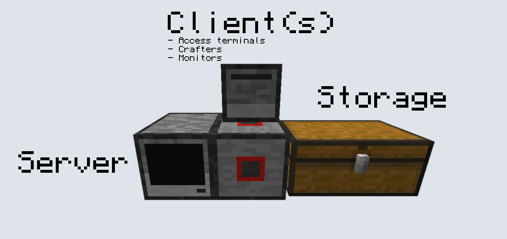
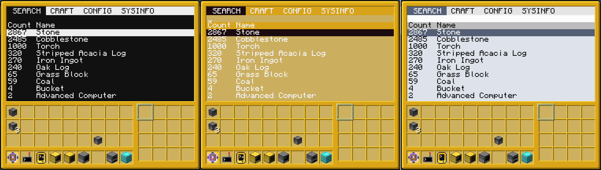
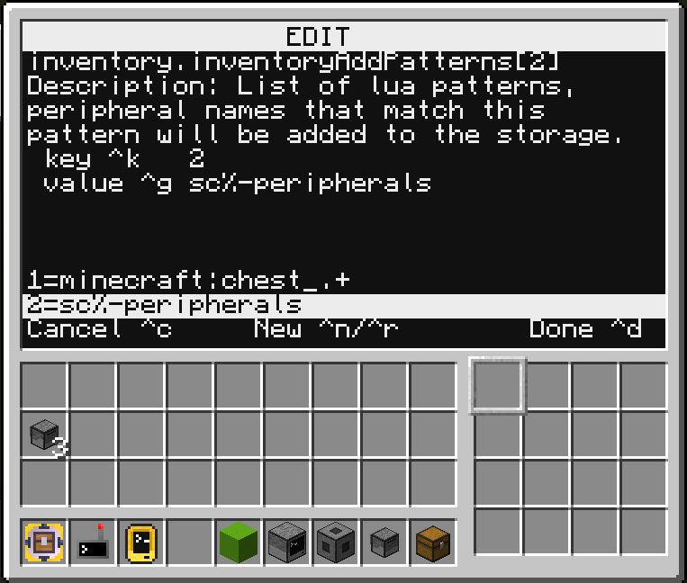
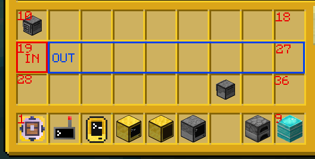

# MISC - Modular Inventory Storage and Crafting

PRs are welcome to this project, I hope the documentation is clear enough, but if you have any questions feel free to ask.

This documentation is also available at misc.madefor.cc

The directory structure of this project is as follows

- `clients/` client programs and libraries
- `modules/` all ready to use modules
- `recipes/` all vanilla grid recipes stored in custom binary format
- `suspended/` modules which development has been suspended on
- `common.lua` common library file (that should be split up in the future)
- `abstractInvLib.lua` local copy of [`abstractInvLib.lua`](https://gist.github.com/MasonGulu/57ef0f52a93304a17a9eaea21f431de6) to ease development, will eventually be removed
- `storage.lua` entrypoint and module loader

# Setup

A minimal MISC system consists of

- A single computer running MISC
- Any number of connected inventories
- A client access terminal

The client can be advanced or basic, it supports both mouse and keyboard.

On both your server and all your clients simply run `wget run https://raw.githubusercontent.com/MasonGulu/CC-MISC/master/installer.lua`.

On your server select the base MISC system option.

On your client select the access terminal option.

Reboot both, the server will ask for a modem, simply input the side your wired modem is attached to.

## MISC Access Terminal

The access terminal is simple and fast to navigate. Across the top bar is a list of screens, you may click one to jump to it, or press tab to cycle between. Type to enter characters into the search bar, use `^u` (ctrl+u) to clear the search bar. Use up/down to navigate and push enter to select, or use mouse wheel and click.

While on a screen with a search bar you may press `^c` to change theme.

### Config tab

Under the CONFIG tab is a list of config options for the MISC system. Selecting one will bring you to a screen with more detailed information about the setting, and the option to change it. Many settings are tables, which will bring you to a graphical table editor. This lets you navigate the table in a tree-like fasion.

### Config table editor

Use `^k` to change the key of the selected element, `^g` to change the value (sorry I can't make it `^v`). Values you enter will be automatically converted into their respective types, tables will be unserialized.

Use `^n` to add a new element at the level you are currently at. Use `^r` to make an element in the parent of the currently selected folder, this is useful for adding multiple tables in the root setting table.

Push `^d` to save and exit, some settings will apply immediately, but most require a restart of the MISC server. Otherwise push `^c` to cancel and your changes will be discarded.

## Adding different inventories

There are 3 factors at play which determine the inventories the system will use.

- `inventory.inventories`, a list of inventory peripheral names to use.

- `inventory.inventoryAddPatterns`, a list of lua patterns to match against all connected peripherals, matching ones will be added.

- `inventory.inventoryRemovePatterns`, any inventories that match patterns in this list will be removed from the list of inventories.

To add an inventory, open your config in your client terminal and naviagate to `inventory.inventoryAddPatterns`.

Select it, and add a new element to the table with `^n`, select the element you added to the table and use `^g` to change its value. This is going to a be a lua pattern, use [this site](https://gitspartv.github.io/lua-patterns/) to help you verify the pattern you choose. For example if I want to add all inventories from the mod `sc-peripherals` I would add `sc%-peripherals` to the table, keeping in mind that `-` is a special character in lua patterns so it must be escaped. Below is an example of this setting being added.

## Adding crafters

On your server run the installer again, this time selecting crafting modules.

Attach furnaces and crafty turtles to your network as desired. No additional setup is required for furnaces. For turtles simply run the client installer and choose crafter turtle.

## Introspection setup

Attach a Manipulator to your MISC system, then on your server run the installer and choose to install the introspection module.

When you start your system it will ask for a URL, SkyCrafter0 provides `wss://ccws.skystuff.cc/connect/<channel name>/[password]`, simply swap out channel name and password as you desire. The first person to connect to a channel sets the password.

Open your MISC config, find `introspection.introspection`. This is a lookup table from username to manipulator peripheral name. Add a new element to the table, set the key to your username, and set the value to the peripheral name of the manipulator attached earlier.

On whatever device you choose as your remote access terminal run the installer, and choose access terminal introspection. Reboot, and select yes for wireless mode and input the URL you chose earlier. Then enter the username associated with the manipulator you would like to use.

By default the client terminal uses the center left slot of your inventory as input, and the rest of the center row as output.

To change this, use the `set` program. The input and output options are ranges of slots. With the input ranging between `misc.importStart` to `misc.importEnd`. The output range is then `misc.exportStart` to `misc.exportEnd`.

# Module Specific Documentation

Look in `/docs/` for development and module specific documentation.
