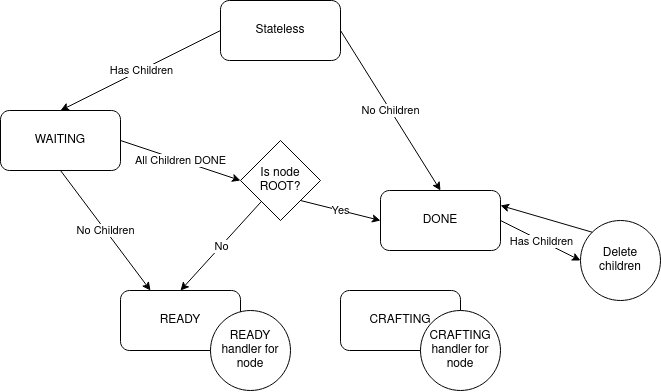
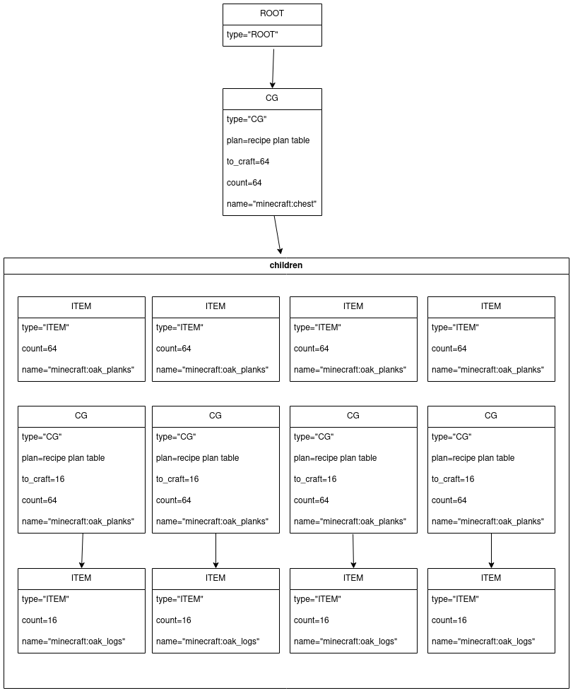

# `crafting.lua`
This is the module that controls autocrafting. It however provides no real usage on its own, currently the only available module is `grid.lua`, however `machine.lua` is also planned.

## Interface Information
This section is only going to cover the basic interface, if you want to add your own crafting provider look further down.

The basic interface methods are `requestCraft`, `startCraft`, `loadJson`, `listCraftables`, and `cancelCraft`.

The first step to craft something is to call `requestCraft(name, count)`. It will return a table of information about the recipe. An example of this table is as follows
```lua
{
  success: boolean,
  toUse = {name=count, ...},
  toCraft = {name=count, ...},
  missing = {name=count, ...}, -- this is not present if success is true
  jobId: string,
}
```
Then if that is successful, you can call `startCraft(jobId)` to start the craft. Otherwise the craft is automatically cancelled.

## Registering Craft Provider
If you want to add a new crafting provider you'll need to do the following.

### Add a craftType
Use `interface.recipeInterface.addCraftType(type, func)` to create a craftType provider. A craftType provider is a function that takes a CraftingNode to modify, an item name, an item count, and an internal use table.

The CraftingNode passed in will already have the `name`, `taskId`, and `jobId` fields filled. You will need to set the `type` and `count` of the node, and any additional fields required by your node handlers.

### Add a readyHandler
Use `interface.recipeInterface.addReadyHandler(type, func)` to create a readyHandler. A readyHandler is a function that takes a node of the given type in the READY state and ticks it.

### Add a craftingHandler
Use `interface.recipeInterface.addCraftingHandler(type, func)` to create a craftingHandler. A craftingHandler is a function that takes a node of the given type in the CRAFTING state and ticks it.

### Add a craftableList
Use `interface.recipeInterface.addCraftableList(type, list)` to set the list of craftable items of this type. This is saved by reference, so it may be modified later. This should be an array of item name strings.

### Optionally add a jsonTypeHandler
Use `interface.recipeInterface.addJsonTypeHandler(jsonType, func)` to register a json recipe importer, when a JSON file is loaded it will be distributed to the appropriate JsonTypeHandler. 


## Crafting System
When a craft is requested `recipeInterface.craft` is called. This starting call has a flag to force the function to find a craft handler for it. `craft` calls each craft handler until one returns true. If none return true there is no recipe available for the item and the craft fails. The craft handler will modify the node, and when necessary call `craft` recursively (making sure to pass in the recursion-protection table).

A craft node has multiple states, when the crafting system is ticked the corrosponding handler for each node type and state is called.

Here's a chart of crafting node states


Here's an example of a generated crafting tree

